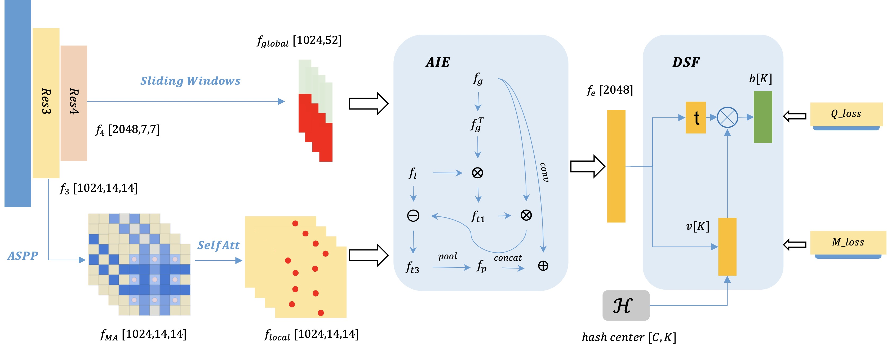

# CSCE-Net:Cross-Scale Context Extracted Hashing for Fine-Grained Image Binary Encoding (ACML 2022)

COMING SOON!

## Pipeline
<p align="center"></p>


## Performances
<p align="center"></p>

<!-- **modified results (should follow cropping results)**

|  			 					 | Roxf-M | +1M | Rpar-M | +1M   | Roxf-H | +1M  | Rpar-H | +1M  |
|:------------------------------:|:------:|:---:|:------:|:-----:|:------:|:----:|:------:|:----:|
|  DOLG-R50(with query cropping) |  81.20 |71.36| 90.07  | 78.99 |  62.55 |47.34 | 79.20  | 59.75|
|  DOLG-R101(with query cropping)|  82.37 |73.63| 90.97  | 80.44 |  64.93 |51.57 | 81.71  | 62.95|
|                                                                                                |
|  DOLG-R50(w/o query cropping)  |  82.38 |77.78| 90.94  | 82.16 |  62.92 | 55.48| 80.48  | 65.77| 
|  DOLG-R101(w/o query cropping) |  83.22 |78.96| 91.64  | 82.89 |  64.83 | 57.86| 82.56  | 67.34|

+1M results is updated.
 -->
## Codes

### Requirements

- NVIDIA GPU, Linux, Python3(tested on 3.6.10)
- Tested with CUDA 10.2, cuDNN 7.1 and PyTorch 1.8.0

```
pip install -r requirements.txt
```
<!-- 
### Training

1. Refer to [`DATA.md`](imgs/DATA.md).

2. Set datapath, model, training parameters in configs/xxxx.yaml and run 

```
python train.py \
    --cfg configs/xxx.yaml  -->
```

### Evaluation

1. xxx

```
python evaler/infer.py --cfg configs/xxx2.yaml
```


### Wights

- [CSCE-res50](https://xxx) (xxx)  
- [CSCE-gcvit](https://xxx) (xxx)


## Citation

If the project helps your research, please consider citing our paper as follows.

```BibTeX
@InProceedings{Xue_2022_ACML,
    author={xxx,xxx},
    title={CSCE-Net:Cross-Scale Context Extracted Hashing for Fine-Grained Image Binary Encoding},
    booktitle={xxx},
    month={xx},
    year={2022},
    pages={xxx}
}

```


## References

<!-- xxx(https://github.com/xxx)
xxx(https://github.com/xx)
DOLG(https://github.com/feymanpriv/DOLG)
 -->
